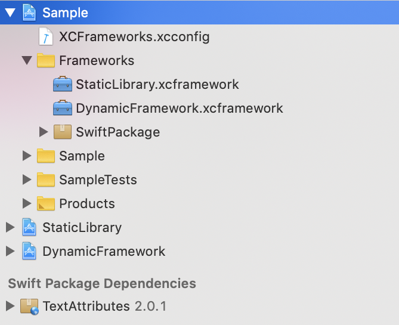
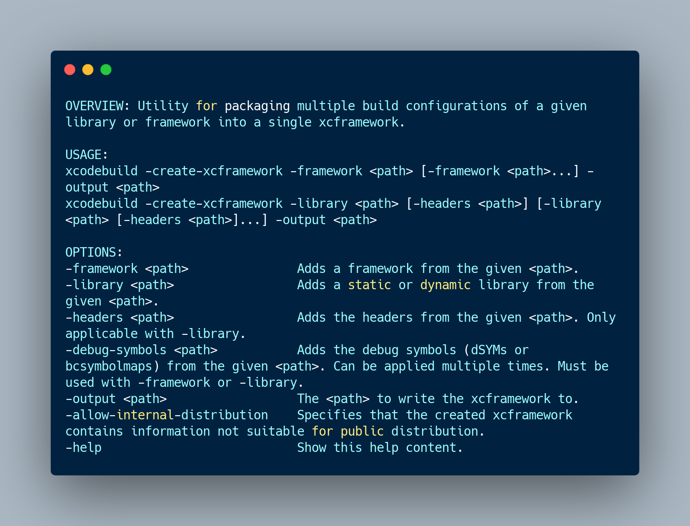

# xcframeworks
This is a demonstration of creating and integrating the xcframeworks and their co-op with static libraries and Swift packages within the same Xcode project.


## Pre-requisities
- Xcode 11
- Swift 5.1 toolchain - run `sudo xcode-select -s path/to/Xcode11` in terminal.
- Github/Gitlab/Bitbucket account set in Xcode's account preferences

# Xcode workspace description

`XCFrameworks` workspace consists of:
- `StaticLibrary` project - represents static library project
- `DynamicFramework` project - represents project that builds dylib
- `Swift Package` - Swift Package for internal development (within Sample project)
- `TextAttributes` - external Swift Package

- `Sample` - Sample project that includes all of the dependencies mentioned above.



---

# .xcframework - How To

## Requirements
- Xcode11
- Swift 5.1 and above

## Motivation & consequences
- gain module stability for your Swift frameworks & Libraries.
- support all mac platforms that share similar architectures - this is where `fat frameworks` comes short - e.g. arm6 architecture can be found in iOS + watchOS, thus using `lipo` wouldnt be sufficient.
- **STOP** creating & using `fat frameworks` == no more `lipo`.
- **STOP** slicing frameworks by stripping the architectures in your projects' targets' custom `build-phase`.

## Platforms
xcframework supports all Apple platforms - `macOS`, `tvOS`, `watchOS`, `iPadOS` platforms.

## List of destinations
| Platform  |  Destination |
|---|---|
| iOS  | generic/platform=iOS  |
| iOS Simulator  | generic/platform=iOS Simulator |
| iPadOS  | generic/platform=iPadOS |
| iPadOS Simulator  | generic/platform=iPadOS Simulator|
| macOS  | generic/platform=macOS  |
| tvOS  | generic/platform=tvOS  |
| watchOS Simulator | generic/platform=watchOS Simulator |


## How to create .xcframeworks that contain iOS + iOS Simulator platforms

### 1. Archive your scheme for desired platforms (destinations)
1.1 Pass `SKIP_INSTALL=NO` && `BUILD_LIBRARY_FOR_DISTRIBUTION=YES` to archive your scheme

```swift
xcodebuild archive \
-workspace MyWorkspace.xcworkspace \
-scheme MyScheme \
-destination destination="generic/platform=iOS" \
-archivePath "archives/MyScheme-iOS" \
SKIP_INSTALL=NO \
BUILD_LIBRARY_FOR_DISTRIBUTION=YES
```

1.2 **iOS Simulator** - archive your scheme for iOS Simulator platform by specifying correct destination `destination="generic/platform=iOS Simulator"` & point archivePath to architecture specific path, e.g. `archives/MyScheme-iOS-Simulator`.

```swift
xcodebuild archive \
..
-destination destination="generic/platform=iOS Simulator" \
-archivePath "archives/MyScheme-iOS-Simulator" \
..
```

1.3 **iOS** - archive your scheme for iOS by specifying `destination="generic/platform=iOS"` & point archivePath to device specific path. The architecture specific path will ensure the archive from step 2. wont be overwritten, e.g. `MyScheme-iOS`

```
xcodebuild archive \
..
-destination destination="generic/platform=iOS" \
-archivePath "archives/MyScheme-iOS" \
..
```

#### Locations
Binaries in `.xcarchive` are located under:

* `Products/Library/Frameworks` folder for dynamic frameworks
* `Products/usr/local/lib` folder for static libraries

### 2. Create .xcframework from built archives

`xcodebuild` allows you to create xcframework by specifying frameworks, libraries or even can add headers to the libraries.



1. Pass all frameworks or libraries that you want to wrap into .xcframework
2. Specify the outpath paht using `-output` argument. Don't forget to add `.xcframework` extension to your output path.

_NOTE:_
*Module Stability for Swift Binary frameworks* is supported starting Swift 5.1.

Module stability is gained, once your module declares `.swiftinterface` file, that describes the public interface of your framework along with linker flags, used toolchain and other info. Swift interface can be found under your framework's `swiftmodule` folder.
`.swiftinterface` file is autogenerated when xcframework is created.


---

## Generate .xcframeworks for iOS + iOS Simulator using create_xcframeworks.sh script
The archiving and creation of `.xcframework` is excercised by [create_xcframeworks.sh](/scripts/create-xcframeworks.sh) script.

This script takes 1 parameter that defines output directory.
`Output directory` will create subfolder for `archives` and `xcframeworks`.

The script will:
- archive the scheme `StaticLibrary` & create the .xcframework
- archive the scheme `DynamicFramework` & create the .xcframework

`Usage`

```
./scripts/create_xcframeworks.sh OUTPUT_DIRECTORY_NAME
```

eg.
```
./scripts/create_xcframeworks.sh Products
```

# Materials

## Presentation about Dependency management in Xcode 11
https://www.slideshare.net/BorisBielik/dependency-management-in-xcode-11-153424888

## Binary Frameworks in Swift
https://developer.apple.com/videos/play/wwdc2019/416/

## ABI Stability & Module Stability - swift.org
https://swift.org/blog/abi-stability-and-more/
