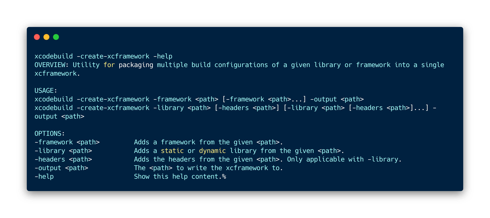
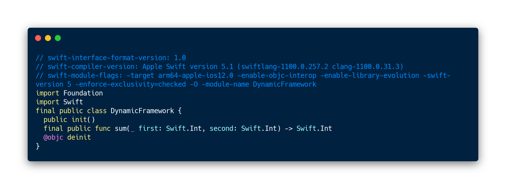

# xcframeworks
Demonstration of creating and integrating the xcframeworks and their co-op with static libraries and Swift packages within the same Xcode project.


## Pre-requisities
- Xcode 11
- command line tools set to Xcode 11 beta, command line tools can be changed in Xcode or by running command `sudo xcode-select -s path/to/Xcode/beta` in terminal.
- Github/Gitlab/Bitbucket account set in Xcode's account preferences

# Xcode workspace description

`XCFrameworks` workspace consists of:
- `StaticLibrary` project - represents static library project
- `DynamicFramework` project - represents project that builds dylib
- `Swift Package` - Swift Package for internal development (within Sample project)
- `TextAttributes` - external Swift Package

- `Sample` - Sample project that includes all of the above + `TextAttributes` remote Swift Package.

---

# XCFrameworks

## How to create .xcframeworks that contain sim + device architectures for iOS platform
_NOTE: please note down that xcframework supports also `macOS`, `tvOS`, `watchOS`, `iPadOS` platforms._

### 1. Archive your scheme
1. Pass `SKIP_INSTALL=NO` && `BUILD_LIBRARY_FOR_DISTRIBUTION=YES` to archive your scheme
2. Archive your scheme for simulator by specifying `destination="generic/platform=iOS Simulator"` & point archivePath to simulator specific path.
3. Archive your scheme for device by specifying `destination="generic/platform=iOS"` & point archivePath to device specific path. The architecture specific path will ensure the archive from step 2. wont be overwritten


Binaries in .xcarchive are located under:

`Products/Library/Frameworks` folder for dynamic frameworks
`Products/usr/local/lib` folder for static libraries

_NOTE: Xcode 11 beta 4 requires `LD_VERIFY_BITCODE=NO` for projects that enable bitcode_
https://twitter.com/krzyzanowskim/status/1151549874653081601

_NOTE: Xcode 11 beta 5 doesn't require `LD_VERIFY_BITCODE=NO` anymore.

### 2. Create .xcframework

Xcodebuild allows you to create xcframework from framework, library or even add headers to libraries.



1. Pass all frameworks or libraries that you want to wrap into .xcframework
2. Specify the outpath paht using `-output` argument. Don't forget to add `.xcframework` extension to your output path.

_NOTE:_
*Module Stability for Swift Binary frameworks* is supported starting Swift 5.1.

Module stability make use of `.swiftinterface` file, that describes the public interface of your framework along with linker flags, used toolchain and other info. Swift interface can be found under your framework's `swiftmodule` folder.



---

## .xcframeworks generation using create_xcframeworks.sh script
The archiving and creating of `.xcframeworks` is excercised by `create_xcframeworks.sh` script.
This script takes 1 parameter that defines output directory.
`Output directory` will create subfolder for `archives` and `xcframeworks`.

The script will:
- archive the scheme `StaticLibrary` & create the .xcframework
- archive the scheme `DynamicFramework` & create the .xcframework

`Usage`

```
./create_xcframeworks.sh OUTPUT_DIRECTORY_NAME
```

eg.
```
create_xcframeworks.sh Products
```

# Materials

## Presentation about Dependency management in Xcode 11
https://www.slideshare.net/BorisBielik/dependency-management-in-xcode-11-153424888

## Binary Frameworks in Swift
https://developer.apple.com/videos/play/wwdc2019/416/
