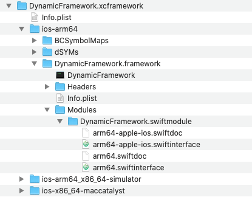

# xcframeworks repo
This is a demonstration of creating and integrating the xcframeworks and their co-op with static libraries and Swift packages within the same Xcode project.

## Table of contents
* [Changelog](#Changelog)
* [Introduction: New .xcframework format](#Introduction-New-xcframework-format)
* [How to create .xcframework that contains iOS + iOS Simulator platforms](#How-to-create-xcframework-that-contains-iOS--iOS-Simulator-platforms)
* [Create xcframework using fastlane plugin](#Create-xcframework-using-fastlane-plugin)
* [Testing & Troubleshooting](#Testing-&-Troubleshooting)
* [Distribution of xcframeworks](#Distribution-of-xcframeworks)
* [How to integrate .xcframework in your project](#How-to-integrate-.xcframework-in-your-project)
* [What's in XCFrameworks workspace](#What's-in-XCFrameworks-workspace)
* [Materials](#Materials)

## Pre-requisities
- Xcode 11 and above
- Swift 5.1 and above
- Github/Gitlab/Bitbucket account set in Xcode's account preferences

# Changelog

| What's new | Xcode version | Swift version | Description |
|---|---|---|---|
| Module stable binaries | Xcode 11 | Swift 5.1 | Library evolution allows the library authors to distribute module stable Swift binaries |
| New version of .swiftinterface interface | Xcode 11.4 | Swift 5.2 | New annotations added to Swift `@_inheritsConvenienceInitializers`, `@_hasMissingDesignatedInitializers`. ⚠️ Module interfaces aren't backwards compatible, clients using Swift 5.1.3 and below won't be able to compile Swift binaries compiled with Swift 5.2. More info [here](https://forums.swift.org/t/cant-use-framework-compiled-with-swift-5-2-in-swift-5-1-3-project/35248/6) |
| Support for binary dependencies in SwiftPM | Xcode 12.0 | Swift 5.3 | Swift Package Manager now supports declaring binary targets in `Package.swift` |
| Debug symbols | Xcode 12.0 | Swift 5.3 | Debug symbols (dSYMs, BCSymbolMaps) can be included within the xcframework through new `-debug-symbols <absolute path>` flag |

# Introduction: New .xcframework format

## Requirements
- Xcode11
- Swift 5.1 and above

## Motivation & consequences
- introduce standard format to gain module stability for your Swift frameworks & libraries. Library author & client of a library are no longer required to use the same version of compiler. Please note, that the module stable interfaces are only forward-compatible
- provide seamless experience when creating & integrating the module stable frameworks
- support all Apple platforms and architectures

- **STOP** creating & using `fat dynamic frameworks`. (library author)
- **STOP** slicing frameworks by stripping the architectures in your projects' targets' custom `build-phase`. (integrator)

## Contents of xcframework

This format bundles module-stable frameworks (.swiftinterface) for the platforms of interest.

The [Info.plist](./Products/xcframeworks/DynamicFramework.xcframework) contains all available frameworks in a bundle specified by library identifiers. This information is used by Xcode during the linking time => xcodebuild picks the right framework for the platform we're building against.
Since Xcode 12.0 the xcframework can contain also debug symbols (dSYMs, BCSymbolMaps).

The structure of xcframework looks as shown below



## Size of xcframework
During my tests I realized, the size of an `xcframework` was smaller than the size of an corresponding `fat framework`. I tested swift only & mixed frameworks.
Generally the `lipo` commandline tool adds a bit of overhead for all contained architectures.

## Platforms
xcframework supports all Apple platforms & their variants - `iOS`, `maccatalyst`, `macOS`, `tvOS`, `watchOS`, `iPadOS`, `carPlayOS`.

## List of destinations
| Platform  |  Destination |
|---|---|
| iOS  | generic/platform=iOS  |
| iOS Simulator  | generic/platform=iOS Simulator |
| maccatalyst | generic/platform=macOS,variant=Mac Catalyst |
| iPadOS  | generic/platform=iPadOS |
| iPadOS Simulator  | generic/platform=iPadOS Simulator|
| macOS  | generic/platform=macOS  |
| tvOS  | generic/platform=tvOS  |
| watchOS | generic/platform=watchOS |
| watchOS Simulator | generic/platform=watchOS Simulator |
| carPlayOS | generic/platform=carPlayOS
| carPlayOS Simulator | generic/platform=carPlayOS Simulator

---

# How to create .xcframework that contains iOS + iOS Simulator platforms

This section describes the process of creating the xcframework by archiving & creating the final xcframeworks from 2 archives built for `iOS` & `iOS Simulator`.

However, if you're not interested in the details of the process of `how` the xcframework is created, head directly to section: [Create xcframework using fastlane plugin](#Create-xcframework-using-fastlane-plugin).

## 1. Archive your scheme for desired platforms (destinations)
1.1 Pass `SKIP_INSTALL=NO` && `BUILD_LIBRARY_FOR_DISTRIBUTION=YES` to archive your scheme

```swift
xcodebuild archive \
-workspace MyWorkspace.xcworkspace \
-scheme MyScheme \
-destination "generic/platform=iOS" \
-archivePath "archives/MyScheme-iOS" \
SKIP_INSTALL=NO \
BUILD_LIBRARY_FOR_DISTRIBUTION=YES
```

1.2 **iOS Simulator** - archive your scheme for iOS Simulator platform by specifying correct destination `destination="generic/platform=iOS Simulator"` & point archivePath to architecture specific path, e.g. `archives/MyScheme-iOS-Simulator`.

```swift
xcodebuild archive \
..
-destination "generic/platform=iOS Simulator" \
-archivePath "archives/MyScheme-iOS-Simulator" \
..
```

1.3 **iOS** - archive your scheme for iOS by specifying `destination="generic/platform=iOS"` & point archivePath to device specific path. The architecture specific path will ensure the archive from step 2. wont be overwritten, e.g. `MyScheme-iOS`

```
xcodebuild archive \
..
-destination "generic/platform=iOS" \
-archivePath "archives/MyScheme-iOS" \
..
```

### Locations
Binaries in `.xcarchive` are located under:

* `Products/Library/Frameworks` folder for dynamic frameworks
* `Products/usr/local/lib` folder for static libraries

## 2. Create .xcframework from built archives

`xcodebuild` allows you to create xcframework by specifying frameworks, libraries or even can add headers to the libraries.


###### 1. Specify all frameworks or libraries that you want to add into .xcframework

###### 2. Specify the outpath path using `-output` argument. Don't forget to add `.xcframework` extension to your output path.

```
xcodebuild -create-xcframework \
           -framework My-iOS.framework \
           -debug-symbols <absolute path to dSYM or BCSymbolMaps folder in the xcarchive> # available from XCode 12.0+
           -framework My-iOS_Simulator.framework \
           -debug-symbols <absolute path to dSYM or BCSymbolMaps folder in the xcarchive> # available from XCode 12.0+
           -output My.xcframework
```

Module stability is gained with Xcode 11 + Swift 5.1, once your module declares `.swiftinterface` file, that describes the public interface of your framework along with linker flags, used toolchain and other info. Swift interface can be found under your framework's `swiftmodule` folder.
`.swiftinterface` file is autogenerated when xcframework is created.


## Create xcframework using fastlane plugin

[This plugin](https://github.com/bielikb/fastlane-plugin-create_xcframework) allows you to generate the `xcframework` (including all dSYMs & BCSymbolMaps) by specifying the desired destinations.
E.g. destination `[iOS]` will generate xcframework that contains slices for both `iOS` & `iOS Simulator`.
⚠️ Currently the plugin doesn't support static libraries.

1. Add plugin to your project
```
fastlane add_plugin create_xcframework
```

2. Add lane to your `Fastfile`
```
desc "Export xcframework"
lane :export_xcframework do
  create_xcframework(
    workspace: 'path/to/your.xcworkspace',
    scheme: 'name of your scheme',
    destinations: ['iOS', 'maccatalyst'],
    xcframework_output_directory: 'Products/xcframeworks'
  )
end
```

_NOTE:_

[Version 1.1.0](https://github.com/bielikb/fastlane-plugin-create_xcframework/releases/tag/v1.1.0) of the fastlane plugin includes support for `debug symbols`.

You can try out the plugin in this project by calling following command:
```
bundle exec fastlane export_xcframework
```

---

# Testing & Troubleshooting

Make sure to always build & run your generated xcframework before distributing it to your clients.
Few of the **problems will unveil just at the compile or run time**, so **don't** rely solely on the success of the xcframework creation.

Here's the list of compiler errors I got across when integrating built xcframework into Xcode project.

| Problem  | Severity |  Description | Solution |
|---|---|---|---|
| Redundant conformance of `x` to `NSObjectProtocol` | error - thrown at dynamic linking time | Your class is already subclassed from `NSObject`, which conforms to `NSObjectProtocol`  | Check protocol conformances of your classes and remove redundant conformance to `NSObjectProtocol` |
| Use of unimplemented initializer 'init()' for class | error - thrown at dynamic linking time | Objective-C ABI public classes need to provide `public` init | Provide `public` init override for your public class:  `override public init()` |
| @objc' class method in extension of subclass of `Class X` requires iOS 13.0.0 | error | Rules for interoperability with Objective-C has changed since iOS 13.0.0. and currently doesn't support `@objc` interoperability in class extensions. There's open question on [Swift forums](https://forums.swift.org/t/xcframework-requires-to-target-ios-13-for-inter-framework-dependencies-with-objective-c-compatibility-tested-with-xcode-11-beta-7/28539) | Move/Remove `@objc` declaration from your Swift class extension |
| scoped imports are not yet supported in module interfaces | warning | Read more about Swift import declarations here: https://nshipster.com/import/ | Import the module instead of specific declaration. For example: change `import class MyModule.MyClass` to `import MyModule` |
| [Can’t use framework compiled with Swift 5.2 in Swift 5.1.3 project](https://forums.swift.org/t/cant-use-framework-compiled-with-swift-5-2-in-swift-5-1-3-project/35248) | error - thrown at linking time | The xcframework was generated using the Swift 5.2 and above. Module stable interfaces are not backwards-compatible. | Update your Xcode to Xcode 11.4 and above or generate module stable binary using Xcode 11.3 and below |
| Incompatible module | error - thrown at linking time | The module built for iOS Simulator shares the same arch slice as the new M1. | Exclude arm64 slice when building your xcframework by specifying following build setting: EXCLUDED_ARCHS[sdk=iphonesimulator*] = arm64 |

---

# Distribution of xcframeworks

* **manually**

Distribution of xcframeworks using the native dependency manager `Swift Package Manager` or the 3rd party dependency managers does come with several reported integration issues. Manual integration seems sofar to be the safest/bullet-proof integration option.

* **Swift Package Manager**

    - [binary targets are supported since Xcode 12.0](https://developer.apple.com/wwdc20/10147)
    - define binary target in your Swift Package manifest.
    - zipped xcframework filename should contain the version number
    - compute the binary checksum by calling `swift package compute-checksum <xcframework filename`.
    - use the computed binary checksum in your Swift Package manifest, when referencing the xcframework remotely.


* **CocoaPods**

    - supported since v1.9.1, several important bug-fixes came with the version [1.10.0](https://github.com/CocoaPods/CocoaPods/releases/tag/1.10.0)
    - As a vendor, you might consider limiting the cocoapods pods audience to avoid any unnecessary issues by specifying the minimum cocoapods version required: eg `spec.cocoapods_version = '>= 1.10.0'``
    - use `vendored_frameworks` to specify you xcframework(s) in your podspec. e.g. `spec.vendored_frameworks = 'DynamicFramework.xcframework'`
    - specify paths to your dSYMs and xcframework in `spec.preserve_paths = [...]`, since Xcode 12 the xcframeworks can contain symbol files, so there's no need to distribute the symbol files explicitly

* **Carthage**  

    - Since version [0.37.0](https://github.com/Carthage/Carthage/releases/tag/0.37.0) Carthage produces xcframeworks for open-sourced depdendencies when `--use-xcframeworks` flag is passed. It doesn't support fetching already existing xcframeworks.

---

# How to integrate .xcframework in your project

1. Drag & drop .xcframework manually into your project's target


2. Embed & sign .xcframework in your project's target


---

# What's in XCFrameworks workspace

`XCFrameworks` workspace consists of:
- `StaticLibrary` project - represents static library project
- `DynamicFramework` project - represents project that builds dylib
- `Swift Package` - Swift Package for internal development (within Sample project)
- `TextAttributes` - external Swift Package

- `Sample` - Sample project that includes all of the dependencies mentioned above.


---

# Materials

## Binary Frameworks in Swift
https://developer.apple.com/videos/play/wwdc2019/416/

## Distribute binary frameworks as Swift packages
https://developer.apple.com/wwdc20/10147
https://developer.apple.com/documentation/swift_packages/distributing_binary_frameworks_as_swift_packages

## ABI Stability & Module Stability - swift.org
https://swift.org/blog/abi-stability-and-more/

## Library evolution in Swift - swift.org
https://swift.org/blog/library-evolution/

## Library evolution for stable ABIs
https://github.com/apple/swift-evolution/blob/master/proposals/0260-library-evolution.md

## Library evolution - Docs
https://github.com/apple/swift/blob/master/docs/LibraryEvolution.rst

## Swift Unwrapped - Swift 5.1 with Doug Gregor (Library evolution, ...)
https://spec.fm/podcasts/swift-unwrapped/308610

## Alexis Beingessner - How Swift Achieved Dynamic Linking Where Rust Couldn't
https://gankra.github.io/blah/swift-abi/

## Alex Grebenyuk - XCFrameworks (case-study about Distribution of xcframeworks as Swift Packages for specific case)
https://kean.blog/post/xcframeworks-caveats
